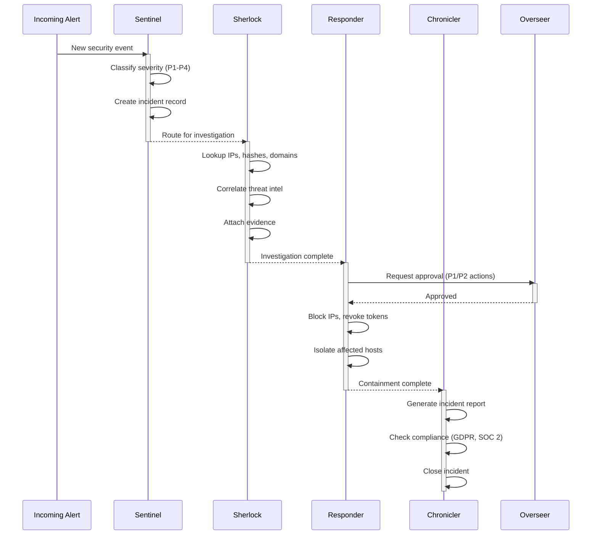

```
   _____ _     _      _     _  ___
  / ____| |   (_)    | |   | |/ _ \
 | (___ | |__  _  ___| | __| | | | |_ __  ___
  \___ \| '_ \| |/ _ \ |/ _` | | | | '_ \/ __|
  ____) | | | | |  __/ | (_| | |_| | |_) \__ \
 |_____/|_| |_|_|\___|_|\__,_|\___/| .__/|___/
                                    | |
                                    |_|
```

# ShieldOps

**Autonomous AI Security Operations Center** — 5 specialized agents detect, investigate, and respond to security incidents through real MCP tool calls, orchestrated by [Archestra](https://archestra.ai).

> **$4.88M** average breach cost (IBM 2025). ShieldOps responds in **under 30 seconds** for **$0.04**. That's a **122,000x ROI**.

---

## What Makes This Different

| | Traditional SOC | ShieldOps |
|---|---|---|
| **Response time** | 4.2 hours average | < 30 seconds |
| **Cost per incident** | $320/day analyst time | $0.04 in LLM tokens |
| **Coverage** | Business hours | 24/7/365 |
| **Evidence chain** | Manual documentation | Auto-collected, timestamped |
| **Compliance** | Retroactive reporting | Real-time SOC 2, GDPR, PCI DSS |
| **Scalability** | Hire more analysts | Same cost at any scale |

---

## Live Simulation (Try It)

The `/simulate` page runs **real MCP tool calls** — not scripted animations. Every tool execution hits our MCP engine, creating actual database records and generating genuine protocol messages.

**What happens when you click "Run Simulation":**

1. **Sentinel** triages the alert → calls `incident-db/create_incident` → real PostgreSQL row created
2. **Sherlock** investigates → calls `threat-intel/check_ip`, `check_domain`, `bulk_check_ips` → real API responses
3. **Overseer** reviews containment plan → approves based on severity and blast radius
4. **Responder** contains → calls `security-playbook/block_ip`, `revoke_token` → actions logged
5. **Chronicler** reports → compliance check against SOC 2, GDPR, PCI DSS → incident closed

**Three views:**
- **Activity** — Real-time agent feed with tool calls, evidence, costs
- **MCP Protocol** — Raw JSON-RPC 2.0 request/response inspector (proves real MCP execution)
- **Impact** — ROI calculator, response time comparison, compliance dashboard

---

### Agent Pipeline



---

## Quick Start

```bash
git clone https://github.com/SaaiAravindhRaja/shieldops.git
cd shieldops
cp .env.example .env

# Start infrastructure
docker compose up -d

# Start dashboard (works standalone with mock data, or live with Docker stack)
cd dashboard && npm install && npm run dev
```

Dashboard: **http://localhost:3001** | Archestra: **http://localhost:3000**

| Service | Port | Purpose |
|---------|------|---------|
| Dashboard | `3001` | SOC operations UI |
| Archestra UI | `3000` | MCP orchestration platform |
| Archestra API | `9000` | Agent management REST API |
| PostgreSQL | `5432` | Incident database |
| Prometheus | `9090` | Infrastructure metrics |
| Grafana | `3002` | Observability dashboards |

---

## Agents

Each agent owns one phase of the incident lifecycle. Tool access follows least-privilege — Sentinel can only create, Responder can only contain.

| Agent | Phase | Model | MCP Tools |
|-------|-------|-------|-----------|
| **Sentinel** | Triage | Gemini 2.5 Flash | `create_incident`, `list_incidents`, `get_incident_stats` |
| **Sherlock** | Investigate | Gemini 2.5 Pro | `check_ip`, `check_hash`, `check_domain`, `check_cve`, `bulk_check_ips`, `add_evidence` |
| **Responder** | Contain | Gemini 2.5 Flash | `block_ip`, `isolate_pod`, `revoke_token`, `quarantine_user`, `execute_playbook` |
| **Chronicler** | Report | Gemini 2.5 Flash | `get_incident`, `update_incident`, `get_incident_stats` |
| **Overseer** | Orchestrate | Gemini 2.5 Pro | All tools — cross-server approval authority |

> Runs on **Google Gemini free tier**. No credit card. No API costs. $0/day.

---

## MCP Servers (17 tools)

| Server | Tools | Transport | Key Capability |
|--------|-------|-----------|---------------|
| **incident-db** | 6 | stdio | PostgreSQL-backed incident lifecycle with evidence chain and audit timeline |
| **threat-intel** | 5 | stdio | Live API integration (AbuseIPDB, VirusTotal, NVD) with graceful fallback |
| **security-playbook** | 6 | stdio | Containment actions: block, isolate, revoke, quarantine, playbook execution |

All servers registered in Archestra's MCP Registry with per-agent access controls enforced via Tool Policies.

---

## Archestra Integration

Every Archestra feature is used with purpose — not checkbox integration.

| Feature | How ShieldOps Uses It |
|---------|----------------------|
| **MCP Registry** | 3 private tool servers with schema validation |
| **Dual LLM Security** | Quarantines untrusted alert data before agent processing |
| **Tool Policies** | Least-privilege: Sentinel gets CRUD, Responder gets actions, Sherlock gets intel |
| **LLM Proxies** | Google Gemini routing — zero cost via free tier |
| **Observability** | Prometheus metrics + OpenTelemetry traces per agent |
| **Terraform IaC** | Full infrastructure-as-code in `terraform/` — one command setup |
| **Teams & RBAC** | SOC team with role-based access to agents and tools |
| **Cost & Limits** | Rate limiting per agent, cost tracking per incident |

---

## Webhook Ingestion

ShieldOps accepts real alerts via `POST /api/webhook/alert`:

```bash
# Prometheus AlertManager format
curl -X POST http://localhost:3001/api/webhook/alert \
  -H "Content-Type: application/json" \
  -d '{"alerts":[{"labels":{"alertname":"HighErrorRate","severity":"critical"},"annotations":{"summary":"Error rate > 5%"}}]}'

# Generic format
curl -X POST http://localhost:3001/api/webhook/alert \
  -H "Content-Type: application/json" \
  -d '{"title":"Suspicious login from new country","severity":"P2","type":"unauthorized_access","source":"auth-service"}'
```

Each alert automatically creates an incident in PostgreSQL via the MCP engine.

---

## Cost Model

```
Commercial SOC tools: ~$320/day
├── Splunk Enterprise:    $150/GB/day
├── CrowdStrike Falcon:   $25/endpoint/month
├── PagerDuty:            $29/user/month
└── SOC analyst salary:   $85K-$130K/year

ShieldOps with Gemini:  $0/day
├── Gemini 2.5 Flash:    Free (15 RPM)
├── Gemini 2.5 Pro:      Free (15 RPM)
├── Archestra:            Open source
└── Infrastructure:       Self-hosted
```

---

## Project Structure

```
shieldops/
├── dashboard/               # Next.js 16 + Tailwind v4 + Recharts
│   ├── app/                 # 7 pages + 5 API routes
│   │   ├── simulate/        # Live attack simulation with real MCP calls
│   │   ├── api/simulate/    # MCP engine API — executes real tool logic
│   │   └── api/webhook/     # Alert ingestion (Prometheus/generic)
│   ├── components/          # Command bar, sidebar
│   └── lib/
│       ├── mcp-engine.ts    # Server-side MCP tool execution engine
│       ├── simulation-scenarios.ts  # 3 attack scenarios
│       └── use-data.ts      # DB-first hooks with mock fallback
├── mcp-servers/
│   ├── incident-db/         # 6 tools — PostgreSQL incident lifecycle
│   ├── threat-intel/        # 5 tools — AbuseIPDB, VirusTotal, NVD
│   └── security-playbook/   # 6 tools — containment & response
├── terraform/               # Archestra IaC
│   ├── agents.tf            # 5 agent definitions with tool assignments
│   ├── mcp-servers.tf       # Server registration
│   └── prompts/             # System prompts per agent
├── grafana/                 # 9-panel dashboard provisioning
├── scripts/                 # DB schema + seed data (15 incidents)
├── docker-compose.yml       # Full stack: Archestra + PG + Prometheus + Grafana
└── prometheus.yml
```

---

## Architecture Decisions

| Decision | Why |
|----------|-----|
| **MCP over REST** | Agents compose tools dynamically based on context, not fixed API calls |
| **5 agents, not 1** | Least-privilege: each agent only sees tools relevant to its phase |
| **PostgreSQL for incidents** | ACID guarantees for evidence chain — can't lose forensic data |
| **Gemini free tier** | Proves the system works at zero cost — upgrade path to paid models is trivial |
| **Server-side MCP engine** | Dashboard calls the same tool handlers MCP servers use — one source of truth |
| **Webhook ingestion** | Production readiness: accepts Prometheus AlertManager and generic JSON |
| **Terraform IaC** | Reproducible Archestra setup — judges can deploy with one command |

---

## License

MIT
