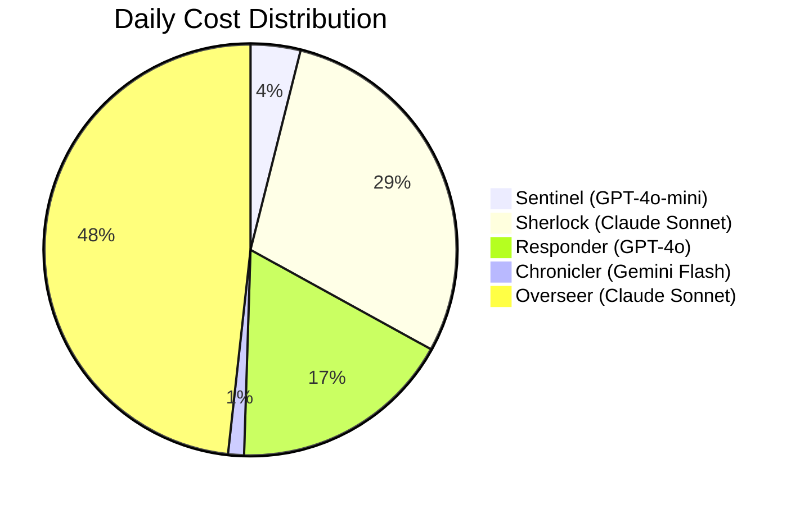

```
   _____ _     _      _     _  ___
  / ____| |   (_)    | |   | |/ _ \
 | (___ | |__  _  ___| | __| | | | |_ __  ___
  \___ \| '_ \| |/ _ \ |/ _` | | | | '_ \/ __|
  ____) | | | | |  __/ | (_| | |_| | |_) \__ \
 |_____/|_| |_|_|\___|_|\__,_|\___/| .__/|___/
                                    | |
                                    |_|
```

# ShieldOps

**Autonomous AI Security Operations Center** — detect, investigate, and respond to security incidents with a multi-agent pipeline orchestrated through [Archestra](https://archestra.ai).

5 specialized agents. 3 MCP tool servers. Full-stack observability.

---

### Agent Pipeline Flow


---

## Getting Started

### Prerequisites

- Docker & Docker Compose
- Node.js 18+
- API keys for OpenAI, Anthropic, and Google AI

### Setup

```bash
git clone https://github.com/SaaiAravindhRaja/shieldops.git
cd shieldops
cp .env.example .env
# add your API keys to .env
```

### Start the stack

```bash
docker compose up -d
```

| Service | Port | |
|---------|------|-|
| Archestra UI | `localhost:3000` | Platform admin |
| Archestra API | `localhost:9000` | REST API |
| PostgreSQL | `localhost:5432` | Incident store |
| Prometheus | `localhost:9090` | Metrics |
| Grafana | `localhost:3002` | Dashboards |

### Start the dashboard

```bash
cd dashboard
npm install
npm run dev
# http://localhost:3001
```

### Seed sample data

```bash
npx tsx scripts/seed-data.ts
```

---

## Agents

Each agent handles one phase of the incident response lifecycle. Models are assigned based on task complexity and cost.

| Agent | Role | Model | Tools |
|-------|------|-------|-------|
| **Sentinel** | Triage incoming alerts, classify severity | GPT-4o-mini | `create_incident`, `list_incidents`, `get_incident_stats` |
| **Sherlock** | Deep investigation, threat correlation | Claude Sonnet | `check_ip`, `check_hash`, `check_domain`, `check_cve`, `bulk_check_ips`, `get_incident`, `add_evidence`, `update_incident` |
| **Responder** | Containment and remediation | GPT-4o | `block_ip`, `isolate_pod`, `revoke_token`, `quarantine_user`, `execute_playbook`, `get_action_log`, `update_incident`, `add_evidence` |
| **Chronicler** | Post-incident reporting, compliance | Gemini Flash | `get_incident`, `update_incident`, `add_evidence`, `get_incident_stats` |
| **Overseer** | Pipeline orchestration, escalation | Claude Sonnet | All tools (cross-server) |

Archestra's **Dual LLM Security Engine** quarantines untrusted data before agents process it. **Tool Policies** enforce least-privilege — Sentinel can only triage, Responder can only contain.

---

## MCP Servers

| Server | Tools | Purpose |
|--------|-------|---------|
| `incident-db` | 6 | Incident CRUD, evidence management, statistics — backed by PostgreSQL |
| `threat-intel` | 5 | IP reputation, file hash analysis, domain lookups, CVE checks |
| `security-playbook` | 6 | Automated response: block, isolate, revoke, quarantine, playbook execution |

All servers use stdio transport and are registered in Archestra's MCP Registry with per-agent access controls.

---

## Archestra Platform Integration

| Feature | How it's used |
|---------|---------------|
| MCP Registry | 3 custom servers registered as private tools |
| Dual LLM Security | Quarantine untrusted alert data before agent processing |
| Tool Policies | Per-agent tool access — least-privilege enforcement |
| Cost & Limits | Daily budgets per agent ($0.50–$30/day) |
| LLM Proxies | Multi-provider routing (OpenAI, Anthropic, Google AI) |
| Observability | Prometheus metrics + OpenTelemetry traces |
| Terraform IaC | Full config in `terraform/` |
| Teams & RBAC | SOC team with role-based access |

---

## Cost Model

Dynamic model selection reduces cost by ~96% compared to using a single premium model:



| Task tier | Model | Cost/call | Rationale |
|-----------|-------|-----------|-----------|
| P4 triage | GPT-4o-mini | $0.001 | Simple classification |
| P3 analysis | GPT-4o | $0.03 | Structured tool use |
| P1 forensics | Claude Sonnet | $0.05 | Complex reasoning chains |
| Reporting | Gemini Flash | $0.001 | Document generation |
| Orchestration | Claude Sonnet | $0.05 | High-stakes decisions |

**Single-model baseline:** ~$320/day &nbsp;→&nbsp; **ShieldOps dynamic switching:** ~$12/day

---

## Dashboard

Next.js 16 app with real-time SOC visibility:

- **Overview** — KPIs, severity breakdown, incident feed, agent status
- **Incidents** — Filterable table, drill-down to investigation timeline and evidence
- **Agents** — Live monitoring with cost gauges, tool usage, activity logs
- **Metrics** — Cost trends, MTTR, detection rates, model cost comparison
- **Settings** — Connection status, platform feature overview

---

## Project Structure

```
shieldops/
├── dashboard/             # Next.js 16 + Tailwind v4 + Recharts
│   ├── app/               # Pages: overview, incidents, agents, metrics, settings
│   ├── components/        # Sidebar, command bar
│   └── lib/               # Types, utils, mock data
├── mcp-servers/
│   ├── incident-db/       # 6 tools — incident CRUD
│   ├── threat-intel/      # 5 tools — threat lookups
│   └── security-playbook/ # 6 tools — response actions
├── terraform/             # Archestra IaC
│   ├── agents.tf          # 5 agent definitions
│   ├── mcp-servers.tf     # Server registration
│   └── prompts/           # Agent system prompts
├── grafana/               # Dashboard provisioning
├── scripts/               # DB schema + seed data
├── docker-compose.yml
└── prometheus.yml
```

---

## Configuring Archestra

After starting the stack, open `localhost:3000`:

1. **LLM API Keys** — Add OpenAI, Anthropic, and Google AI keys
2. **Security Engine** — Enable Dual LLM for prompt injection protection
3. **MCP Registry** — Register the 3 tool servers
4. **Agents** — Create the 5 agents with their system prompts
5. **Tool Policies** — Assign per-agent tool access
6. **Cost & Limits** — Set daily budgets
7. **Teams** — Create SOC team and assign roles

Or apply everything at once with Terraform:

```bash
cd terraform
terraform init && terraform apply
```

---

## License

MIT
